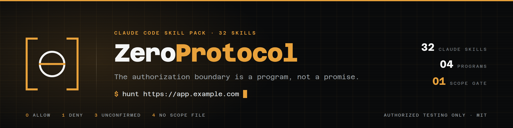

<p align="center">
  
</p>

# ZeroProtocol

One protocol for authorized bug-bounty and web-security work, as **32 Claude Code skills** and
four helper programs. Clone it, ask Claude to check it, give it a target.

The authorization boundary is a program, not a promise: every skill that sends traffic calls
`zp-scope check` and obeys the exit code, so an out-of-scope host is refused mechanically rather
than remembered politely.

```
you:     hunt https://app.example.com
claude:  phase 0  mode?  -> bug bounty
         phase 1  scope  -> .zeroprotocol/scope.yaml written, NOT confirmed
                            passive recon starts; active testing stays locked
         you:     zp-scope confirm --by me --authorization https://hackerone.com/example
         phase 2  passive recon   CT logs, archives, JS bundles, GitHub
         phase 3  active recon    live hosts, tech, content discovery
         phase 4  rank            queue.md: P1 / P2 / blocked / chain-pending
         phase 5  hunt            routed to the class that matches the surface
         phase 6  prove           two stacks, redacted evidence, browser for client-side
         phase 7  triage          the seven questions; most leads die here, correctly
         phase 8  report          drafted for YOU to send. Never auto-submitted.
```

## Install

```bash
git clone https://github.com/MaramHarsha/ZeroProtocol
cd ZeroProtocol
./install.sh
```

Then open Claude Code in any directory and say `hunt <your authorized target>`.

`install.sh` symlinks `skills/` into `~/.claude/skills/` so the skills load in every session,
seeds the operating-discipline notes into the project memory directory, adds a marker-delimited
block to `~/.claude/CLAUDE.md`, and links `bin/zp-*` onto your PATH. It is idempotent, it backs
up anything it would displace, and `./install.sh --remove` undoes all of it.

```
./install.sh --copy           copy instead of symlink (survives deleting this clone)
./install.sh --dry-run        print every action, change nothing
./install.sh --no-global-md   skip the ~/.claude/CLAUDE.md block
./install.sh --remove         clean uninstall
```

Or just open Claude Code in this directory and say **"check this"** — `CLAUDE.md` tells Claude
what to do.

## The 32 skills

| | |
|---|---|
| **router** | `zeroprotocol` — owns the pipeline, the ranking, and the dispatch table |
| **gate & setup** | `zp-scope` `zp-toolchain` `zp-proxy` |
| **recon** | `zp-recon-passive` `zp-recon-active` `zp-content-discovery` `zp-js-secrets` `zp-takeover` |
| **injection** | `zp-xss` `zp-sqli` `zp-rce-ssti` `zp-xxe-lfi` `zp-upload` |
| **access control** | `zp-idor` `zp-authz` `zp-jwt-oauth` |
| **server-side logic** | `zp-ssrf` `zp-smuggling` `zp-cache-poison` `zp-race` |
| **interfaces** | `zp-api` `zp-graphql` `zp-cors` |
| **platforms** | `zp-cloud` `zp-mobile` `zp-web3` `zp-code-audit` |
| **known CVEs** | `zp-cve-2026-41940` — cPanel/WHM pre-auth bypass · `zp-cve-lightrag` — three LightRAG advisories |
| **output** | `zp-triage` `zp-report` |

Each one carries its gate, an executable procedure, real commands with a documented fallback for
every tool it likes, payload tables, a **confirm-or-kill** section, the escalation paths, and the
pitfalls that make reports get closed.

## The four helper programs

```bash
zp-scope check https://api.target.com/v1   # 0 allow · 1 deny · 3 unconfirmed · 4 no scope file
zp-doctor                                  # what works on this box, and how it degrades
zp-init target.com                         # scaffold .zeroprotocol/
zp-memory-seed                             # seed the operating notes into this project's memory
```

`zp-scope` is the keystone. `init` writes the contract, `confirm` requires a human to state their
authorization, `check` is what the skills call, and `filter` is the funnel you pipe a host list
through before anything touches it. Widening `in_scope` clears the confirmation automatically,
because nobody signed off on the new hosts.

`zp-doctor` exists because ZeroProtocol is built to **degrade, never to fail**. It has no
required tooling beyond `python3 curl dig git openssl jq`; everything else has a documented
fallback, and where there is no honest fallback (`nuclei`) the skills say the capability is
unavailable rather than substituting a weaker check and calling it coverage.

## What it will not do

ZeroProtocol is for programs you are enrolled in, engagements with a signed scope, and assets you
own. It is deliberately missing the other half of the usual toolkit:

- It will not send a packet to a host a confirmed scope file does not allow.
- It will not test an excluded class — DoS, volumetric, social engineering, physical, spam.
- It stops at **proof**. `id` output, not a shell. A version string, not a database dump. One
  bucket key, not the bucket. A fork test, not a mainnet transaction.
- It will not use a credential it discovers. Finding it is the bug.
- It will not mass-scan a host list.
- It will not submit a report. You read it and you send it.

Those limits are not timidity. Every one of them is the line between a Critical finding that gets
paid and an incident the program's lawyers handle — and none of them makes a report less likely
to be accepted.

## Acknowledgements

Distilled from 54 public bug-bounty and offensive-security skill repositories (≈18,000 `SKILL.md`
files) — among them [uphiago/recon-skills](https://github.com/uphiago/recon-skills),
[elementalsouls/claude-bughunter](https://github.com/elementalsouls/claude-bughunter),
[sw33tLie/bbscope](https://github.com/sw33tLie/bbscope),
[caido/skills](https://github.com/caido/skills),
[PatrikFehrenbach/h1-brain](https://github.com/PatrikFehrenbach/h1-brain),
[trailofbits/skills](https://github.com/trailofbits/skills),
[yaklang/hack-skills](https://github.com/yaklang/hack-skills) and
[snailsploit/claude-red](https://github.com/snailsploit/claude-red). ZeroProtocol is a rewrite,
not a repackage: the phase gates, the mechanical scope enforcement, the per-class stop points and
the degradation contract are its own.

## License

MIT — see [LICENSE](LICENSE). Authorized testing only; see [SECURITY.md](SECURITY.md).
